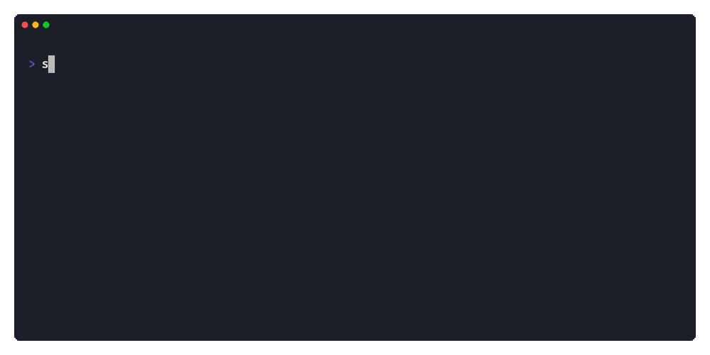

# 🌶️ sracha 🌶️

[](https://anaconda.org/bioconda/sracha)

Fast SRA downloader and FASTQ converter, written in pure Rust.

## Features

- **Parallel downloads** -- chunked HTTP Range requests with multiple connections
- **Native VDB parsing** -- pure Rust, zero C dependencies
- **Integrated pipeline** -- download, convert, and compress in one command
- **Project-level accessions** -- pass a BioProject (PRJNA) or study (SRP) to download all runs
- **Accession lists** -- batch download from a file with `--accession-list`
- **Parallel gzip or zstd** -- pigz-style block compression via rayon
- **FASTA output** -- drop quality scores with `--fasta`
- **SRA and SRA-lite** -- full quality or simplified quality scores
- **Split modes** -- split-3, split-files, split-spot, interleaved
- **Stdout streaming** -- pipe interleaved FASTQ to downstream tools with `-Z`
- **Resumable downloads** -- automatically resumes interrupted transfers
- **File validation** -- verify SRA file integrity with `sracha validate`
- **VDB introspection** -- `sracha vdb` inspects local `.sra` files (tables, columns, metadata, schema) as a pure-Rust replacement for `vdb-dump`

## How it works

`sracha get` runs the full pipeline in one command:

1. **Resolve** -- looks up the accession via direct S3 URL (with SDL API fallback)
2. **Download** -- fetches the `.sra` file with parallel chunked HTTP Range requests
3. **Parse** -- reads the KAR archive and decodes VDB columns (READ, QUALITY, READ_LEN, NAME)
4. **Output** -- formats FASTQ (or FASTA) records and compresses with parallel gzip/zstd

## Demo



## Quick start

```bash
# Download, convert, and compress in one shot
sracha get SRR28588231

# Download all runs from a BioProject
sracha get PRJNA675068

# Batch download from an accession list
sracha get --accession-list SRR_Acc_List.txt

# Just download
sracha fetch SRR28588231

# Convert a local .sra file
sracha fastq SRR28588231.sra

# Show accession info
sracha info SRR28588231

# Validate a downloaded file
sracha validate SRR28588231.sra
```

See the [Getting Started](getting-started.md) guide for more examples, or
the [CLI Reference](cli.md) for all options.

## Installation

### From binary releases

Download pre-built binaries from the
[releases page](https://github.com/rnabioco/sracha-rs/releases).

### From source

Requires Rust 1.92+.

```bash
cargo install --git https://github.com/rnabioco/sracha-rs sracha
```

### With Bioconda

```bash
pixi add --channel bioconda sracha
```

## Acknowledgments

sracha builds on the [Sequence Read Archive](https://www.ncbi.nlm.nih.gov/sra),
maintained by the [National Center for Biotechnology Information](https://www.ncbi.nlm.nih.gov/)
at the National Library of Medicine. The SRA and its
[toolchain](https://github.com/ncbi/sra-tools) are public-domain software
developed by U.S. government employees — our tax dollars at work. Special
thanks to Kenneth Durbrow ([@durbrow](https://github.com/durbrow)) and the
SRA Toolkit team for building and maintaining the infrastructure that makes
projects like this possible.

This project wouldn't exist without NCBI's open infrastructure: the
VDB/KAR format, the SDL locate API, EUtils, and public S3 hosting of
sequencing data. sracha aims to make it easier for the community to
build on that foundation.
